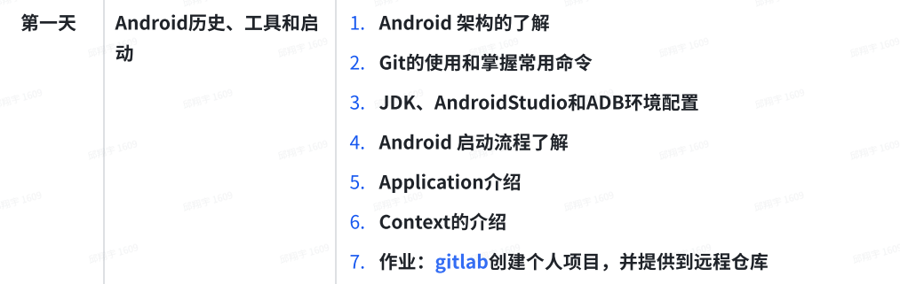

## 一、任务

> 学习目标：




## 二、笔记

> **带着问题：**

1. 什么是Android？
2. Android架构
3. JDK、SDK、Android SDK的区别
4. ADB是什么
5. JVM和DVM
6. RAM、ROM、Flash
7. Android启动流程（围绕一个程序和三个进程展开）
8. Fork克隆一个新拷贝（分支）
9. 一个程序：Bootloader
10. 三个进程区别：Init Zygote SystemServer
11. Application：是什么？为什么有这个？主要可以做什么？使用的注意事项？
12. Context：是什么？为什么有这个？主要可以做什么？使用的注意事项？
13. Application和Context的区别


1. 配置了Android开发环境、Git环境并进行基本操作
2. 了解Android的架构、开发工具、Android启动流程、Application和Context
3. 完成第一天作业


1. 学习了kotlin的变量、逻辑控制语句、面向对象编程


> 碰到问题：背景-项目使用的是kotlin；build configuration language也是kotlin

1. 项目打开后gradle下载缓慢
2. 项目依赖下载缓慢
3. 更换下载镜像后出错：`Android Studio Unexpected tokens (use ； to separate expressions on the same line)`


```properties
maven { setUrl("https://maven.aliyun.com/nexus/content/repositories/releases/") }
maven { setUrl("https://maven.aliyun.com/repository/jcenter") }
maven { setUrl("https://maven.aliyun.com/repository/google") }
maven { setUrl("https://maven.aliyun.com/repository/central") }
maven { setUrl("https://maven.aliyun.com/repository/public") }
maven { setUrl("https://maven.aliyun.com/repository/gradle-plugin") }
maven { setUrl("https://jitpack.io") }
maven { setUrl("https://dl.google.com/dl/android/maven2/") }
```


```
distributionBase=GRADLE_USER_HOME
distributionPath=wrapper/dists
distributionUrl=https://mirrors.cloud.tencent.com/gradle/gradle-8.0-bin.zip
zipStoreBase=GRADLE_USER_HOME
zipStorePath=wrapper/dists
```


## 三、博客汇总

> 解决Android Studio Unexpected tokens (use ； to separate expressions on the same line)

https://blog.csdn.net/qq_56992543/article/details/134359927


> Android studio项目gradle相关资源下载慢问题

https://juejin.cn/post/7315258057289351195


> 安卓启动流程：

https://www.cnblogs.com/Wesuiliye/articles/16275531.html


> JVM DVM ART：

https://blog.csdn.net/li0978/article/details/114990969


> Android重难点解析：

https://zhaokaiqiang.gitbook.io/the-analysis-of-android-key-point/android_system


## 四、Application理解

在Android开发中，`Application`类是整个应用程序的基础类，它提供了全局应用程序状态的维护和应用程序级别资源的管理。理解`Application`类及其作用，对于Android开发者来说至关重要。以下是对Android内`Application`类的详细解析：

### Application类的概念

**`Application`类**是在Android应用启动时首先创建的类，它代表了应用程序的全局状态。`Application`类仅在应用进程创建时实例化一次，并在整个应用生命周期内保持存在。因此，它非常适合用来存储全局状态和共享资源。

### 为什么需要`Application`类？

1. **全局状态管理**：
   `Application`类允许开发者在整个应用程序中存储和共享数据，而不需要在各个组件之间传递数据。例如，可以在`Application`中存储全局变量，这些变量可以在应用的任何地方被访问和修改。

2. **统一初始化**：
   在应用程序启动时，有许多初始化工作需要完成，例如配置日志框架、初始化第三方库、设置全局异常处理器等。将这些初始化工作集中在`Application`类中，可以简化管理和维护。

3. **全局`Context`**：
   `Application`类提供了一个全局的`Context`对象，便于在应用的任何地方使用。这对于需要一个持续存在的`Context`的操作（如显示Toast消息、启动Activity等）非常有用。

### 主要功能

1. **全局变量和方法**：
   `Application`类可以保存应用程序的全局状态信息和全局方法，供整个应用程序使用。

2. **初始化工作**：
   可以在`Application`类中进行全局的初始化工作，如初始化数据库、配置网络库、设置全局异常处理器等。

3. **全局异常处理**：
   可以在`Application`类中设置一个全局的未捕获异常处理器，以捕获并处理所有未捕获的异常，防止应用崩溃。

### 使用方法

#### 自定义Application类

要使用`Application`类，您需要创建一个自定义的类继承自`Application`，并在`AndroidManifest.xml`文件中进行声明。

```java
// MyApplication.java
public class MyApplication extends Application {
    @Override
    public void onCreate() {
        super.onCreate();
        // 在此处进行全局初始化工作
        // 例如，初始化日志框架
        // 初始化第三方库
    }
}
```

#### 在AndroidManifest.xml中声明

```xml
<application
    android:name=".MyApplication"
    ...>
    <!-- 其他配置 -->
</application>
```

### 主要可以做什么？

1. **全局变量和方法**：
   将需要在多个Activity或Service中使用的全局变量和方法放在`Application`类中。

   ```java
   public class MyApplication extends Application {
       private String globalVar;
   
       public String getGlobalVar() {
           return globalVar;
       }
   
       public void setGlobalVar(String globalVar) {
           this.globalVar = globalVar;
       }
   }
   ```

2. **初始化工作**：
   在`onCreate()`方法中进行一些初始化工作，如数据库的初始化、网络库的配置等。

   ```java
   @Override
   public void onCreate() {
       super.onCreate();
       // 初始化数据库
       // 初始化网络库
   }
   ```

3. **全局异常处理**：
   设置一个全局的未捕获异常处理器，以捕获并处理所有未捕获的异常。

   ```java
   @Override
   public void onCreate() {
       super.onCreate();
       Thread.setDefaultUncaughtExceptionHandler(new Thread.UncaughtExceptionHandler() {
           @Override
           public void uncaughtException(Thread thread, Throwable throwable) {
               // 处理未捕获的异常
           }
       });
   }
   ```

### 使用的注意事项

1. **内存泄漏**：
   由于`Application`类在整个应用生命周期中一直存在，因此需要注意避免内存泄漏。例如，不要持有`Activity`或`Service`的引用。

2. **单例模式**：
   由于`Application`类本身就是单例的，因此不需要再通过单例模式来获取`Application`实例，可以直接通过`getApplicationContext()`方法获取全局的`Context`。

3. **避免过度使用**：
   虽然`Application`类非常方便，但应避免将过多的逻辑放在其中，保持其简洁和高效。

### 总结

`Application`类是Android应用程序的核心组件之一，它提供了一个全局的环境和状态管理机制。通过自定义`Application`类，可以实现应用程序级别的初始化工作、全局状态管理和资源共享，从而简化应用的开发和维护。理解和正确使用`Application`类，将有助于开发出更加稳定和高效的Android应用。


## 五、Context理解

在Android开发中，`Context`是一个非常重要的概念。它代表了应用程序的环境信息，提供了访问应用程序资源和类的一种方式。为了更好地理解`Context`，我们可以将其视为应用程序的句柄，它使得应用程序的不同组件能够相互通信并访问系统服务。

### `Context`的角色和作用

#### 1. **什么是`Context`？**

`Context`是一个抽象类，Android中的许多操作都需要一个`Context`来执行。它可以提供应用程序环境的各种信息和服务，例如访问资源、启动Activity、获取系统服务等。

#### 2. **为什么需要`Context`？**

`Context`为应用程序提供了一个访问应用程序级别资源和类的接口。它提供了一种统一的方式来访问系统服务、应用资源、文件系统等。这使得应用程序的不同部分能够互相通信并共享数据。

#### 3. **主要功能**

`Context`提供了一些关键功能，包括但不限于：

- **访问资源**：通过`Context`，您可以访问应用程序的资源（如字符串、图片、布局文件）。
- **启动组件**：使用`Context`可以启动Activity、Service，发送广播等。
- **获取系统服务**：`Context`允许您访问各种系统服务，例如`LocationManager`、`Vibrator`、`WindowManager`等。
- **处理文件**：通过`Context`可以访问应用程序的文件系统，读写应用私有文件。

### `Context`的类型

在Android中，`Context`有几种主要类型：

1. **Application Context**：
   - `Application`类的实例。它的生命周期与应用程序相同。
   - 适用于需要一个全局且长生命周期的`Context`，如单例模式、跨Activity的操作等。
   - 例子：`getApplicationContext()`。

2. **Activity Context**：
   - `Activity`类的实例。它的生命周期与Activity相同。
   - 适用于与Activity相关的操作，如启动一个新的Activity，显示对话框等。
   - 例子：`this`（在Activity中）。

3. **Service Context**：
   - `Service`类的实例。它的生命周期与Service相同。
   - 适用于与Service相关的操作，如启动其他服务、发送广播等。
   - 例子：`this`（在Service中）。

4. **Other Contexts**：
   - `ContextWrapper`、`ContextThemeWrapper`等，提供特定功能的上下文。

### 使用`Context`的注意事项

- **避免内存泄漏**：
  - 尽量避免长生命周期的`Context`持有短生命周期的对象，例如在`Application`级别的单例中持有`Activity`的引用。这会导致内存泄漏。
  - 使用`Application Context`而不是`Activity Context`来避免持有`Activity`的引用。

- **正确选择`Context`类型**：
  - 在需要启动Activity或显示对话框时，应使用`Activity Context`。
  - 在需要进行与应用程序全局相关的操作时，应使用`Application Context`。

### 示例解析

#### 场景：显示Toast消息

Toast是一种简单的消息提示框，可以用来显示短暂的信息。我们可以通过`Context`来显示Toast消息：

```java
// 在Activity中显示Toast
Toast.makeText(this, "Hello, World!", Toast.LENGTH_SHORT).show();

// 在非Activity类中显示Toast
public class MyClass {
    private Context context;

    public MyClass(Context context) {
        this.context = context;
    }

    public void showToast() {
        Toast.makeText(context, "Hello, World!", Toast.LENGTH_SHORT).show();
    }
}
```

在这个例子中，我们在Activity中使用`this`作为`Context`，而在非Activity类中，我们通过构造函数传递`Context`。

#### 场景：访问资源

通过`Context`来访问资源，例如获取字符串资源：

```java
// 在Activity中获取字符串资源
String appName = getString(R.string.app_name);

// 在非Activity类中获取字符串资源
public class MyClass {
    private Context context;

    public MyClass(Context context) {
        this.context = context;
    }

    public void printAppName() {
        String appName = context.getString(R.string.app_name);
        System.out.println(appName);
    }
}
```

在这个例子中，同样通过`Context`来获取资源，无论是在Activity中还是在其他类中。

### 总结

`Context`是Android应用程序中至关重要的部分，它为应用程序提供了访问资源和服务的接口。理解`Context`的类型和使用方法，有助于编写高效、健壮的Android应用程序。正确使用`Context`，尤其是在避免内存泄漏和选择合适的`Context`类型方面，是Android开发中的关键技能。


## 六、区别

> 我的问：
>
> 也就是说Application是一个应用程序里面的，而Context是连接我手机的操作系统和应用程序的桥梁，比如我现在的App收到一条消息，需要显示给操作系统的下拉框提示栏，就通过Context来实现的，而Context是一个接口，下面有很多具体的实现，我可以实现弹窗类型的，也能实现提示栏类型的，对吗

是的，你的理解基本正确。让我们进一步详细解释一下。

### Application和Context的关系

- **Application**：是你应用程序的全局类，在应用启动时首先被创建，并在整个应用生命周期内存在。它可以看作是一个全局的`Context`，提供应用级别的全局状态和资源管理。

- **Context**：是Android应用程序与操作系统交互的桥梁。它是一个抽象类，提供了访问应用资源和系统服务的接口。`Context`有多种实现，例如`Activity`、`Service`和`Application`，这些类都继承自`Context`。

### Context的作用

`Context`提供了许多重要功能，允许应用程序访问系统资源和服务。通过`Context`，你可以执行以下操作：

- **访问资源**：例如，获取字符串、图片、布局文件等。
- **启动组件**：例如，启动一个新的Activity、Service，或发送广播。
- **获取系统服务**：例如，获取通知管理器、布局填充器、窗体管理器等。
- **处理文件**：例如，访问应用的私有文件。

### 具体实现和使用场景

#### 1. **显示Toast消息（弹窗类型）**

Toast是一种短暂的消息提示框，用于向用户显示一些信息。你可以使用`Context`来显示Toast消息。

```java
// 在Activity中
Toast.makeText(this, "Hello, World!", Toast.LENGTH_SHORT).show();

// 在非Activity类中
public class MyUtility {
    private Context context;

    public MyUtility(Context context) {
        this.context = context;
    }

    public void showToast() {
        Toast.makeText(context, "Hello, World!", Toast.LENGTH_SHORT).show();
    }
}
```

#### 2. **显示通知（提示栏类型）**

通知是一种显示在系统通知栏中的消息，用于向用户传递重要信息。你可以使用`Context`来创建和显示通知。

```java
public void showNotification(Context context) {
    NotificationManager notificationManager = (NotificationManager) context.getSystemService(Context.NOTIFICATION_SERVICE);
    String channelId = "default_channel_id";
    String channelDescription = "Default Channel";

    // For Android Oreo and above, you need to create a notification channel
    if (Build.VERSION.SDK_INT >= Build.VERSION_CODES.O) {
        NotificationChannel channel = new NotificationChannel(channelId, channelDescription, NotificationManager.IMPORTANCE_DEFAULT);
        notificationManager.createNotificationChannel(channel);
    }

    NotificationCompat.Builder builder = new NotificationCompat.Builder(context, channelId)
        .setSmallIcon(R.drawable.ic_notification)
        .setContentTitle("New Message")
        .setContentText("You've received a new message.")
        .setPriority(NotificationCompat.PRIORITY_DEFAULT);

    notificationManager.notify(1, builder.build());
}
```

#### 3. **获取系统服务**

你可以使用`Context`来获取各种系统服务，例如获取布局填充器以动态加载布局。

```java
LayoutInflater inflater = (LayoutInflater) context.getSystemService(Context.LAYOUT_INFLATER_SERVICE);
View view = inflater.inflate(R.layout.custom_layout, null);
```

### 总结

- **Application**：是应用程序的全局类，提供全局状态和资源管理。
- **Context**：是Android应用程序与操作系统交互的桥梁，提供访问资源和系统服务的接口。
- **多种Context实现**：`Activity`、`Service`、`Application`等都是`Context`的具体实现。

你可以使用`Context`来显示Toast消息、创建通知、获取系统服务等。`Context`的灵活性和多种实现方式使得它在Android开发中非常重要。正确使用`Context`能够帮助你编写高效、稳定的应用程序。
